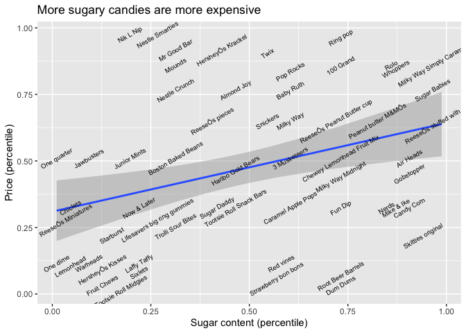

Visualizing data with ggplot2
================

## Load R Studio Packages and Datasets

This code was taken from an
[example](www.kaggle.com/rtatman/visualizing-data-with-ggplot2#Table-of-Contents)
by Rachael Tatman in Kaggle. [1]

``` r
# read in our libraries
library(tidyverse) # includes ggplot2
```

    ## ── Attaching packages ─────────────────────────────────────── tidyverse 1.3.1 ──

    ## ✓ ggplot2 3.3.5     ✓ purrr   0.3.4
    ## ✓ tibble  3.1.4     ✓ dplyr   1.0.7
    ## ✓ tidyr   1.1.3     ✓ stringr 1.4.0
    ## ✓ readr   2.0.1     ✓ forcats 0.5.1

    ## ── Conflicts ────────────────────────────────────────── tidyverse_conflicts() ──
    ## x dplyr::filter() masks stats::filter()
    ## x dplyr::lag()    masks stats::lag()

``` r
library(ggthemes) # includes pre-made themes we'll use near the end
library(readr)

# read in our data
candyRankings <- read_csv("candy-data.csv")
```

    ## Rows: 85 Columns: 13

    ## ── Column specification ────────────────────────────────────────────────────────
    ## Delimiter: ","
    ## chr  (1): competitorname
    ## dbl (12): chocolate, fruity, caramel, peanutyalmondy, nougat, crispedricewaf...

    ## 
    ## ℹ Use `spec()` to retrieve the full column specification for this data.
    ## ℹ Specify the column types or set `show_col_types = FALSE` to quiet this message.

``` r
candyProduction <- read_csv("candy_production.csv")
```

    ## Rows: 548 Columns: 2

    ## ── Column specification ────────────────────────────────────────────────────────
    ## Delimiter: ","
    ## dbl  (1): IPG3113N
    ## date (1): observation_date

    ## 
    ## ℹ Use `spec()` to retrieve the full column specification for this data.
    ## ℹ Specify the column types or set `show_col_types = FALSE` to quiet this message.

## Plot Data

    ## `geom_smooth()` using formula 'y ~ x'

<!-- -->

Note that the `echo = FALSE` parameter was added to the code chunk to
prevent printing of the R code that generated the plot.

**Citations**

[1] TATMAN, RACHAEL. “Visualizing Data with GGPLOT2.” Kaggle, Kaggle, 9
Jan. 2018,
www.kaggle.com/rtatman/visualizing-data-with-ggplot2\#Table-of-Contents.
